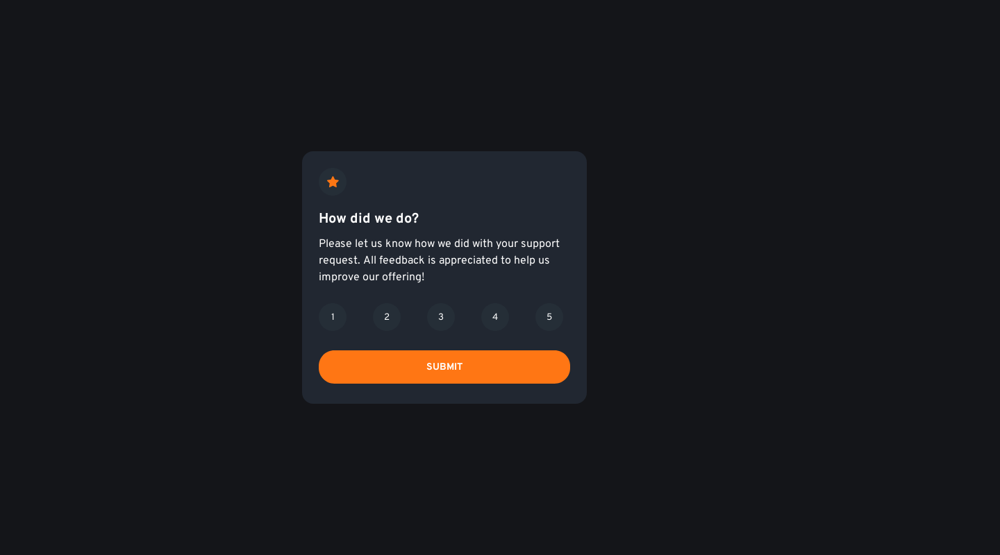
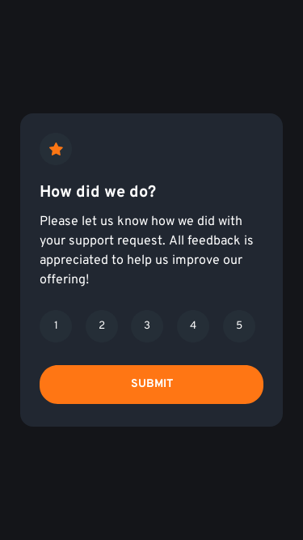

# Frontend Mentor - Interactive rating component solution

This is a solution to the [Interactive rating component challenge on Frontend Mentor](https://www.frontendmentor.io/challenges/interactive-rating-component-koxpeBUmI). Frontend Mentor challenges help you improve your coding skills by building realistic projects. 

## Table of contents

- [Overview](#overview)
- [The challenge](#the-challenge)
- [Screenshot](#screenshot)
- [Built with](#built-with)
- [Author](#author)

## Overview

### The challenge

Users should be able to:

- View the optimal layout for the app depending on their device's screen size
- See hover states for all interactive elements on the page
- Select and submit a number rating
- See the "Thank you" card state after submitting a rating

### Screenshot

### Built with

- Pug
- Sass
- Flexbox
- Mobile-first workflow 
- [Tailwind](https://tailwindcss.com/) - CSS framework
- [daisyUI](https://daisyui.com/) - Tailwind CSS component library

## Author

- Frontend Mentor - [@peterhannell](https://www.frontendmentor.io/profile/peterhannell)